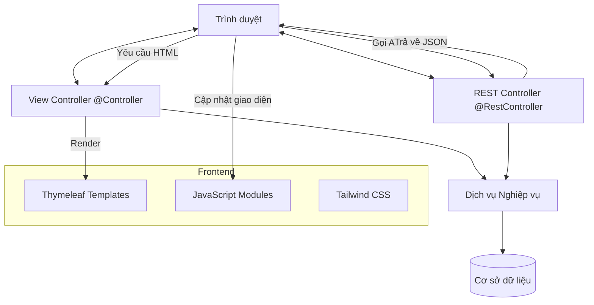

# Kế hoạch Kiến trúc Frontend: Thymeleaf + JavaScript + Tailwind CSS

Bản kế hoạch này phác thảo việc triển khai giao diện hiện đại, phản hồi tốt cho hệ thống Fashion Store bằng cách sử dụng Thymeleaf của Spring Boot, Tailwind CSS và Vanilla JavaScript.

## 1. Kiến trúc Tổng thể

Kiến trúc tuân theo cách tiếp cận lai (hybrid):
- **Server-Side Rendering (SSR)**: Thymeleaf render HTML ban đầu, layout và nội dung tĩnh (tốt cho SEO).
- **Client-Side Logic (AJAX/Fetch)**: JavaScript xử lý các tương tác động, gọi API (JWT) và cập nhật UI mà không cần tải lại toàn bộ trang.



## 2. Cấu trúc Thư mục Hiện tại

```text
src/main/resources/
├── static/
│   ├── js/
│   │   ├── pages/           # JS dành riêng cho từng trang
│   │   │   ├── login.js
│   │   │   └── register.js
│   │   └── common.js        # Logic toàn cục (giỏ hàng, auth check)
│   └── images/              # Logo, banners, placeholder products
└── templates/
    ├── layouts/
    │   └── layout.html      # Layout chính (chứa Tailwind config & Google Fonts)
    ├── fragments/
    │   ├── header.html      # Header 2 tầng (Brand & Nav)
    │   └── footer.html      # Footer thông tin & social
    └── pages/               # Các trang nội dung cụ thể
        ├── login.html       # Sign In
        ├── register.html    # Sign Up (khớp RegisterRequestDTO)
        ├── index.html       # Trang chủ
        ├── category.html    # Danh sách sản phẩm
        └── product-detail.html # Chi tiết sản phẩm
```

## 3. Bản đồ Ánh xạ: View vs API

| Trang / Tính năng | URL View | API Backend (REST) | Mô tả |
| :--- | :--- | :--- | :--- |
| Trang Chủ | `/` | N/A | Landing page |
| Đăng nhập | `/login` | `POST /api/auth/login` | Xác thực JWT |
| Đăng ký | `/register` | `POST /api/auth/register` | Tạo tài khoản mới |
| Danh sách SP | `/category` | `GET /api/products` | Lọc và phân trang |
| Chi tiết SP | `/product-detail/{id}` | `GET /api/products/{id}` | Thông tin chi tiết biến thể |

## 4. Thiết kế & Thẩm mỹ (Digital Curator)

Hệ thống sử dụng phong cách **Brutalist Minimalism**:
- **Border Radius**: Cố định `0px` cho toàn bộ element (nút, input, card).
- **Màu sắc**: Bảng màu Monochrome (Đen/Trắng/Xám) kết hợp sắc cam `secondary` làm điểm nhấn.
- **Typography**: Sử dụng font `Inter` hoặc `Outfit` mang lại cảm giác hiện đại, cao cấp.
- **Icons**: Sử dụng `Google Material Symbols Outlined`.

## 5. Xử lý Lỗi & Bảo mật

Hệ thống đã cấu hình các Handler tùy chỉnh để trả về mã lỗi chuẩn REST:
- **401 Unauthorized**: Xử lý bởi `JwtAuthenticationEntryPoint` khi người dùng chưa đăng nhập hoặc token hết hạn.
- **403 Forbidden**: Xử lý bởi `CustomAccessDeniedHandler` khi người dùng đã đăng nhập nhưng không đủ quyền truy cập (ví dụ: Customer vào trang Admin).

## 6. Các Best Practices (Quy tắc Tốt nhất)

1.  **Layout**: Sử dụng `layout:decorate` và `layout:fragment` (Thymeleaf Layout Dialect) để tái sử dụng mã nguồn.
2.  **Logic JS**: Tách biệt logic xử lý form vào các file JS riêng trong `static/js/pages/`.
3.  **Tailwind CDN/Build**: Hiện tại sử dụng Play CDN cho phát triển nhanh. Khi triển khai production, cần chuyển sang build CSS để tối ưu hóa hiệu suất.
4.  **Header gọn nhẹ**: Header được thiết kế 2 tầng nhưng tối ưu chiều cao (`48px` cho tầng trên, `32px` cho tầng dưới) để ưu tiên không gian cho nội dung chính.
`

## 6. Các Best Practices (Quy tắc Tốt nhất)

1.  **Layout**: Sử dụng `th:replace` để quản lý `header.html` và `footer.html` một cách tập trung.
2.  **Logic JS**: Tuyệt đối không để logic nghiệp vụ phức tạp ở Frontend. Frontend chỉ đóng vai trò thu thập dữ liệu và gọi API.
3.  **Tailwind CSS**: Sử dụng lệnh `npm run build` để tối ưu hóa dung lượng CSS cho môi trường thực tế.
4.  **Xử lý Lỗi**: Tận dụng cấu trúc lỗi JSON từ `GlobalExceptionHandler` của Backend để hiển thị thông báo lỗi chi tiết và chuyên nghiệp trên giao diện.
